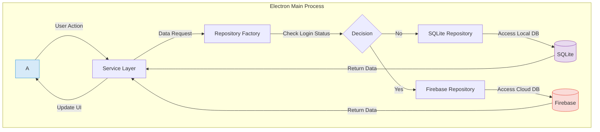
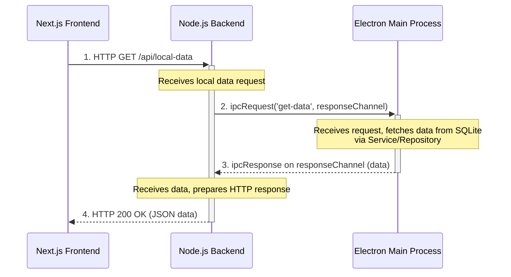

# Glass: Design Patterns and Architectural Overview

Welcome to the Glass project! This document is the definitive guide to the architectural patterns, conventions, and design philosophy that guide our development. Adhering to these principles is essential for building new features, maintaining the quality of our codebase, and ensuring a stable, consistent developer experience.

The architecture is designed to be modular, robust, and clear, with a strict separation of concerns.

---

## Core Architectural Principles

These are the fundamental rules that govern the entire application.

1.  **Centralized Data Logic**: All data persistence logic (reading from or writing to a database) is centralized within the **Electron Main Process**. The UI layers (both Electron's renderer and the web dashboard) are forbidden from accessing data sources directly.
2.  **Feature-Based Modularity**: Code is organized by feature (`src/features`) to promote encapsulation and separation of concerns. A new feature should be self-contained within its own directory.
3.  **Dual-Database Repositories**: The data access layer uses a **Repository Pattern** that abstracts away the underlying database. Every repository that handles user data **must** have two implementations: one for the local `SQLite` database and one for the cloud `Firebase` database. Both must expose an identical interface.
4.  **AI Provider Abstraction**: AI model interactions are abstracted using a **Factory Pattern**. To add a new provider (e.g., a new LLM), you only need to create a new provider module that conforms to the base interface in `src/common/ai/providers/` and register it in the `factory.js`.
5.  **Single Source of Truth for Schema**: The schema for the local SQLite database is defined in a single location: `src/common/config/schema.js`. Any change to the database structure **must** be updated here.
6.  **Encryption by Default**: All sensitive user data **must** be encrypted before being persisted to Firebase. This includes, but is not limited to, API keys, conversation titles, transcription text, and AI-generated summaries. This is handled automatically by the `createEncryptedConverter` Firestore helper.

---

## I. Electron Application Architecture (`src/`)

This section details the architecture of the core desktop application.

### 1. Overall Pattern: Service-Repository

The Electron app's logic is primarily built on a **Service-Repository** pattern, with the Views being the HTML/JS files in the `src/app` and `src/features` directories.

-   **Views** (`*.html`, `*View.js`): The UI layer. Views are responsible for rendering the interface and capturing user interactions. They are intentionally kept "dumb" and delegate all significant logic to a corresponding Service.
-   **Services** (`*Service.js`): Services contain the application's business logic. They act as the intermediary between Views and Repositories. For example, `sttService` contains the logic for STT, while `summaryService` handles the logic for generating summaries.
-   **Repositories** (`*.repository.js`): Repositories are responsible for all data access. They are the *only* part of the application that directly interacts with `sqliteClient` or `firebaseClient`.

**Location of Modules:**
-   **Feature-Specific**: If a service or repository is used by only one feature, it should reside within that feature's directory (e.g., `src/features/listen/summary/summaryService.js`).
-   **Common**: If a service or repository is shared across multiple features (like `authService` or `userRepository`), it must be placed in `src/common/services/` or `src/common/repositories/` respectively.

### 2. Data Persistence: The Dual Repository Factory

The application dynamically switches between using the local SQLite database and the cloud-based Firebase Firestore.

-   **SQLite**: The default data store for all users, especially those not logged in. This ensures full offline functionality. The low-level client is `src/common/services/sqliteClient.js`.
-   **Firebase**: Used exclusively for users who are authenticated. This enables data synchronization across devices and with the web dashboard.

The selection mechanism is a sophisticated **Factory and Adapter Pattern** located in the `index.js` file of each repository directory (e.g., `src/common/repositories/session/index.js`).

**How it works:**
1.  **Service Call**: A service makes a call to a high-level repository function, like `sessionRepository.create('ask')`. The service is unaware of the user's state or the underlying database.
2.  **Repository Selection (Factory)**: The `index.js` adapter logic first determines which underlying repository to use. It imports and calls `authService.getCurrentUser()` to check the login state. If the user is logged in, it selects `firebase.repository.js`; otherwise, it defaults to `sqlite.repository.js`.
3.  **UID Injection (Adapter)**: The adapter then retrieves the current user's ID (`uid`) from `authService.getCurrentUserId()`. It injects this `uid` into the actual, low-level repository call (e.g., `firebaseRepository.create(uid, 'ask')`).
4.  **Execution**: The selected repository (`sqlite` or `firebase`) executes the data operation.

This powerful pattern accomplishes two critical goals:
-   It makes the services completely agnostic about the underlying data source.
-   It frees the services from the responsibility of managing and passing user IDs for every database query.

**Visualizing the Data Flow**

---

## II. Web Dashboard Architecture (`pickleglass_web/`)

This section details the architecture of the Next.js web application, which serves as the user-facing dashboard for account management and cloud data viewing.

### 1. Frontend, Backend, and Main Process Communication

The web dashboard has a more complex, three-part architecture:

1.  **Next.js Frontend (`app/`):** The React-based user interface.
2.  **Node.js Backend (`backend_node/`):** An Express.js server that acts as an intermediary.
3.  **Electron Main Process (`src/`):** The ultimate authority for all local data access.

Crucially, **the web dashboard's backend cannot access the local SQLite database directly**. It must communicate with the Electron main process to request data.

### 2. The IPC Data Flow

When the web frontend needs data that resides in the local SQLite database (e.g., viewing a non-synced session), it follows this precise flow:

1.  **HTTP Request**: The Next.js frontend makes a standard API call to its own Node.js backend (e.g., `GET /api/conversations`).
2.  **IPC Request**: The Node.js backend receives the HTTP request. It **does not** contain any database logic. Instead, it uses the `ipcRequest` helper from `backend_node/ipcBridge.js`.
3.  **IPC Emission**: `ipcRequest` sends an event to the Electron main process over an IPC channel (`web-data-request`). It passes three things: the desired action (e.g., `'get-sessions'`), a unique channel name for the response, and a payload.
4.  **Main Process Listener**: The Electron main process has a listener (`ipcMain.on('web-data-request', ...)`) that receives this request. It identifies the action and calls the appropriate **Service** or **Repository** to fetch the data from the SQLite database.
5.  **IPC Response**: Once the data is retrieved, the main process sends it back to the web backend using the unique response channel provided in the request.
6.  **HTTP Response**: The web backend's `ipcRequest` promise resolves with the data, and the backend sends it back to the Next.js frontend as a standard JSON HTTP response.

This round-trip ensures our core principle of centralizing data logic in the main process is never violated.

**Visualizing the IPC Data Flow**

